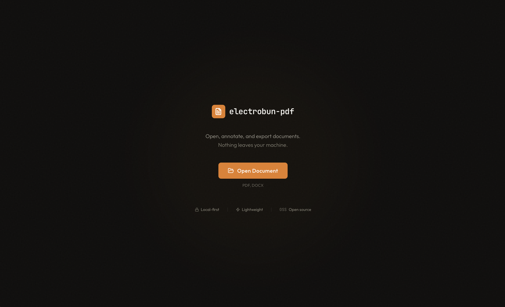
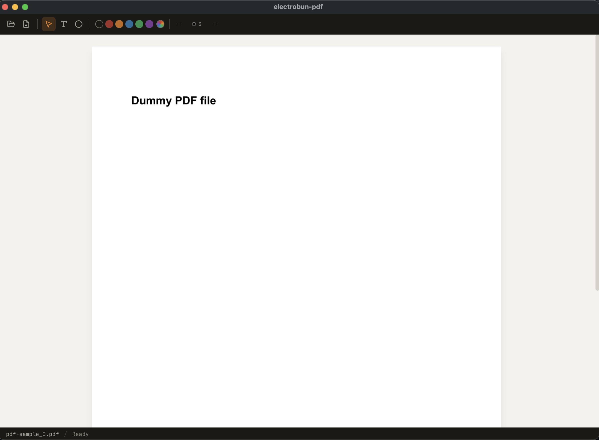
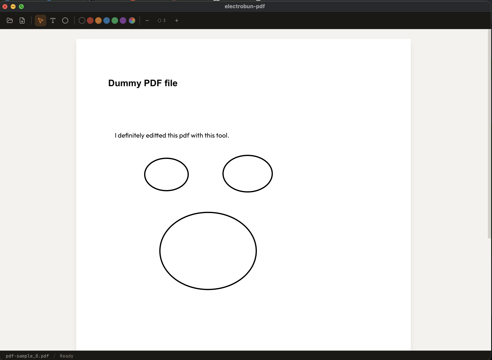

# electrobun-pdf

Local-first PDF & DOCX editor built with [Electrobun](https://github.com/blackboardsh/electrobun). Open, annotate, and export documents — nothing leaves your machine.



## Features

- **Open PDF & DOCX** files with a native file picker — or **drag & drop** a file anywhere in the window
- **Pixel-perfect PDF rendering** via [MuPDF](https://mupdf.com/) WASM — logos, fonts, form fields all preserved
- **Annotate PDFs** — add text, draw circles/ovals, choose colors, adjust stroke width
- **Drag & drop annotations** — reposition text and shapes after placing them
- **Delete annotations** — hover any annotation in select mode and click the red **×**
- **Undo/Redo** — Cmd+Z / Cmd+Shift+Z
- **Page indicator** — the status bar tracks the current page as you scroll
- **Export to PDF** — saves annotated documents with a native folder picker
- **DOCX editing** — full rich text editor powered by [TipTap](https://tiptap.dev/)
- **Lightweight** — ~12MB app bundle using system WebKit (no bundled Chromium)

### Before & After

| Original PDF | After annotation |
|:---:|:---:|
|  |  |

## Keyboard Shortcuts

| Key | Action |
|-----|--------|
| `V` | Select / move tool |
| `T` | Text annotation tool |
| `C` | Circle / oval tool |
| `Esc` | Back to select mode / finish text editing |
| `Cmd+Z` | Undo |
| `Cmd+Shift+Z` | Redo |
| Double-click text | Edit placed text |
| Hover annotation + `×` | Delete annotation (select mode) |

Empty text boxes are discarded automatically when you click away, so a stray click with the text tool never leaves invisible annotations behind.

## Getting Started

### Prerequisites

- [Bun](https://bun.sh/) v1.x+
- macOS 14+, Windows 11+, or Ubuntu 22.04+

### Install & Run

```bash
git clone https://github.com/GijungKim/electrobun-pdf.git
cd electrobun-pdf
bun install
bun run start
```

`bun run start` builds the frontend with Vite and launches the Electrobun app.

For development with hot reload:

```bash
bun run dev:hmr
```

## Architecture

```
src/
  bun/                  # Main process (Bun runtime)
    index.ts            # Window, menus, RPC handlers, file I/O
    fileParser.ts       # PDF rendering (MuPDF) & DOCX parsing (Mammoth)
  mainview/             # Webview (React + Tailwind)
    App.tsx             # App shell, state management
    rpc.ts              # RPC bridge to main process
    components/
      WelcomeScreen.tsx
      PdfToolbar.tsx    # Annotation tool bar
      PdfAnnotationLayer.tsx  # Text & circle annotations per page
      Toolbar.tsx       # DOCX rich text toolbar
      StatusBar.tsx
    utils/
      fileHandlers.ts   # PDF export via jsPDF
  shared/
    types.ts            # Typed RPC schema
```

### How it works

| Step | What happens |
|------|-------------|
| **Open PDF** | Bun reads the file, MuPDF (WASM) renders each page as a PNG, sent to webview page-by-page via fire-and-forget RPC |
| **Open DOCX** | Bun reads the file, Mammoth converts to HTML, sent to webview and loaded into TipTap editor |
| **Drag & drop** | The webview reads the dropped file's bytes and sends them to Bun over RPC (base64), then the same parse/render path runs |
| **Annotate** | React components overlay SVG circles and positioned text inputs on top of page images |
| **Export** | jsPDF composites page images + annotation coordinates directly onto PDF pages (no html2canvas) |

### Key dependencies

| Package | Purpose |
|---------|---------|
| [Electrobun](https://github.com/blackboardsh/electrobun) | Desktop shell (native webview + Bun) |
| [MuPDF](https://www.npmjs.com/package/mupdf) | PDF page rendering (WASM) |
| [Mammoth](https://www.npmjs.com/package/mammoth) | DOCX to HTML conversion |
| [TipTap](https://tiptap.dev/) | Rich text editor (ProseMirror) |
| [jsPDF](https://www.npmjs.com/package/jspdf) | PDF generation for export |

## License

[MIT](LICENSE)
