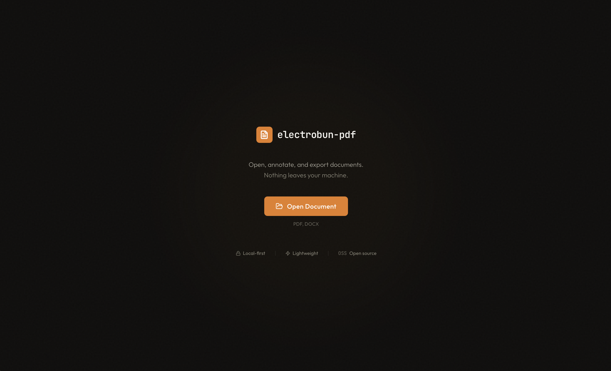
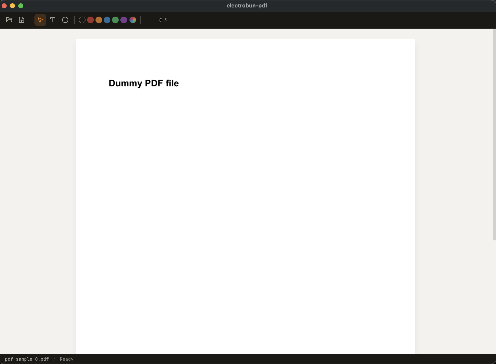
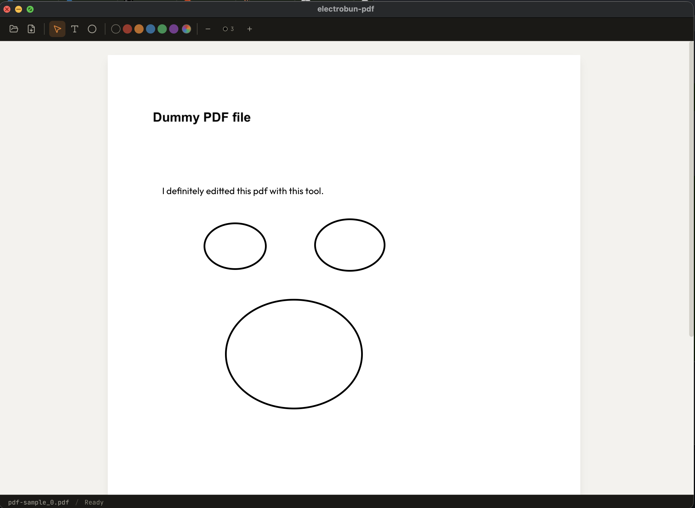

# electrobun-pdf

Local-first PDF & DOCX editor built with [Electrobun](https://github.com/blackboardsh/electrobun). Open, annotate, and export documents — nothing leaves your machine.



## Features

- **Open PDF & DOCX** files with a native file picker — or **drag & drop** a file anywhere in the window
- **Pixel-perfect PDF rendering** via [MuPDF](https://mupdf.com/) WASM — logos, fonts, form fields all preserved
- **Annotate PDFs** — add text, draw circles/ovals, choose colors, adjust stroke width
- **Replace PDF text (prototype)** — click a detected word, type a short replacement, and keep the rest of the original PDF searchable
- **Drag & drop annotations** — reposition text and shapes after placing them
- **Delete annotations** — hover any annotation in select mode and click the red **×**
- **Undo/Redo** — Cmd+Z / Cmd+Shift+Z, multi-level and across all pages (the affected page scrolls into view)
- **Page indicator** — the status bar tracks the current page as you scroll
- **Export to PDF** — saves annotated documents with a native folder picker
- **DOCX editing** — full rich text editor powered by [TipTap](https://tiptap.dev/)
- **Lightweight** — uses the system WebKit on macOS instead of bundling Chromium

### Before & After

| Original PDF | After annotation |
|:---:|:---:|
|  |  |

## Keyboard Shortcuts

| Key | Action |
|-----|--------|
| `V` | Select / move tool |
| `T` | Text annotation tool |
| `R` | Replace detected PDF text |
| `C` | Circle / oval tool |
| `Esc` | Back to select mode / finish text editing |
| `Cmd+Z` | Undo |
| `Cmd+Shift+Z` | Redo |
| Double-click text | Edit placed text |
| Hover annotation + `×` | Delete annotation (select mode) |

Empty text boxes are discarded automatically when you click away, so a stray click with the text tool never leaves invisible annotations behind.

The replacement prototype currently supports horizontal, born-digital Windows-1252 text. Export reuses the decoded original PDF font when it contains every replacement glyph, preserving its size, baseline, style, and color where feasible. Embedded subsets that lack a glyph, or fonts that cannot be safely re-embedded, use a style-compatible Helvetica, Times, or Courier fallback and report that fallback in the status bar. The on-page preview is provisional; export uses MuPDF font metrics and refuses text that cannot fit at 5pt or larger instead of clipping it. Rotated source text is not offered for replacement, and replacement characters outside Windows-1252 are rejected at export.

## Getting Started

### Prerequisites

- [Bun](https://bun.sh/) v1.4+ — for installing dependencies and running scripts; the packaged app runs its main process on Cottontail and does not ship Bun
- The current packaged macOS Apple Silicon build requires **macOS 26.5.2+** (the minimum embedded in the bundled Cottontail executable).
- Windows 11+ or Ubuntu 22.04+ for the other supported development targets; this release does not provide binaries for those platforms.

### Install & Run

```bash
git clone https://github.com/GijungKim/electrobun-pdf.git
cd electrobun-pdf
bun install
bun run start
```

`bun run start` prepares the Electrobun 2 devkit, builds the frontend with Vite, and launches the app. On the first run, Electrobun downloads its paired Hutch toolchain into `~/.hutch` and projects the SDK into the ignored `.hutch/devkit` directory.

For development with hot reload:

```bash
bun run dev:hmr
```

### Verify & Package

```bash
bun run typecheck
bun test
bun run build:canary
```

For a stable-channel package, run `bun run build:stable`. Packaging writes ignored local output under `build/` and `artifacts/`; it does not publish a release. The current project configuration has no trusted publisher signing, notarization, application icons, or `release.baseUrl`; configure and verify those separately before distributing builds publicly.

Distribution requires more than a successful package build. Follow [SOURCE.md](SOURCE.md) to create and verify the corresponding source archive for the exact release commit, regenerate [THIRD_PARTY_NOTICES.md](THIRD_PARTY_NOTICES.md), and keep the license and notices beside every binary artifact. Packaged apps also contain these files, and the **Help** menu links to the public source and license.

## Architecture

```
src/
  bun/                  # Main process (runs on Cottontail, Electrobun's JSC runtime)
    index.ts            # Window, menus, RPC handlers, file I/O
    fileParser.ts       # PDF rendering/text edits (MuPDF) & DOCX parsing (Mammoth)
  mainview/             # Webview (React + Tailwind)
    App.tsx             # App shell, state management
    rpc.ts              # RPC bridge to main process
    components/
      WelcomeScreen.tsx
      PdfToolbar.tsx    # Annotation tool bar
      PdfAnnotationLayer.tsx  # Text & circle annotations per page
      Toolbar.tsx       # DOCX rich text toolbar
      StatusBar.tsx
    utils/
      fileHandlers.ts   # PDF export via jsPDF
      docExport.ts      # DOCX (ProseMirror JSON) → styled PDF blocks & line layout
      annotations.ts    # Per-page annotation document (immutable snapshots)
      history.ts        # Generic undo/redo history over those snapshots
      geometry.ts       # Coordinate helpers
  shared/
    types.ts            # Typed RPC schema
```

### How it works

| Step | What happens |
|------|-------------|
| **Open PDF** | The main process reads the file, MuPDF (WASM) renders each page and extracts clickable word geometry, sent to the webview page-by-page via fire-and-forget RPC |
| **Open DOCX** | The main process reads the file, Mammoth converts to HTML, sent to webview and loaded into TipTap editor |
| **Drag & drop** | The webview reads the dropped file's bytes and sends them to the main process over RPC (base64), then the same parse/render path runs |
| **Annotate** | React components overlay SVG circles and positioned text inputs on top of page images |
| **Export PDF** | MuPDF applies text-only redactions, searchable replacement text, and annotations to the original PDF; DOCX export still uses jsPDF |

### Key dependencies

| Package | Purpose |
|---------|---------|
| [Electrobun](https://github.com/blackboardsh/electrobun) | Desktop shell (native webview + Cottontail main process) |
| [MuPDF](https://www.npmjs.com/package/mupdf) | PDF page rendering (WASM) |
| [Mammoth](https://www.npmjs.com/package/mammoth) | DOCX to HTML conversion |
| [TipTap](https://tiptap.dev/) | Rich text editor (ProseMirror) |
| [jsPDF](https://www.npmjs.com/package/jspdf) | PDF generation for export |

## License

Copyright (c) 2026 Tony(Gijung) Kim. This project is distributed under the [GNU Affero General Public License, version 3 or later](LICENSE).

See [NOTICE](NOTICE) for the licensing provenance of earlier MIT-licensed versions and [THIRD_PARTY_NOTICES.md](THIRD_PARTY_NOTICES.md) for third-party components.
